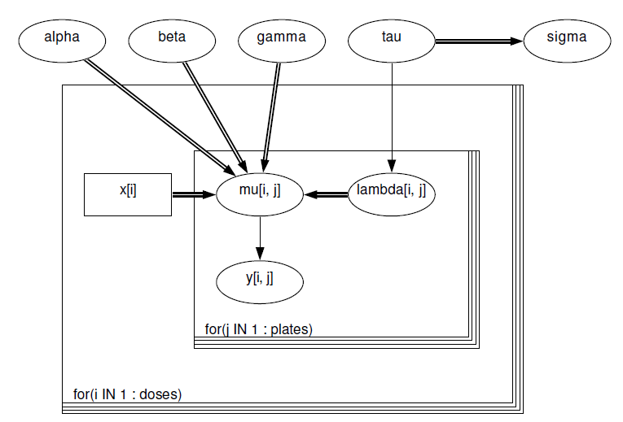
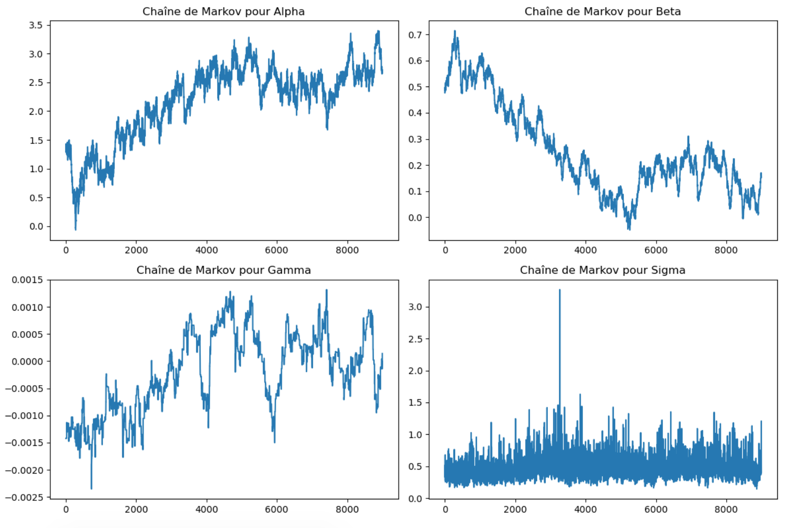

**Lien vers notre Github** : <https://github.com/mblmatheus/projet_bayes_2.git>

# Données étudiées :

Breslow (1984) analysa des données d'essais de mutagénicité (présentées ci-dessous) sur la salmonelle dans lesquelles trois plaques ont été traitées à chaque dose $i$ de quinoline et le nombre de colonies réversibles de Salmonella TA98 fut mesuré. Une certaine courbe dose-réponse fut suggérée par la théorie.

```{=tex}
\begin{table}[h]
\centering
\small
\begin{minipage}{0.45\textwidth}
\centering
\begin{tabular}{|c|c|c|c|c|c|}
\hline
0    & 10   & 33   & 100  & 333  & 1000 \\\hline
15   & 16   & 16   & 27   & 33   & 20   \\
21   & 18   & 26   & 41   & 38   & 27   \\
29   & 21   & 33   & 69   & 41   & 42   \\
\hline
\end{tabular}
\caption{Dose de quinoléine (mg par plaque)}
\label{tab:tableau1}
\end{minipage}\hfill
\end{table}
```
# Visualisation graphique :

```{r, echo=FALSE,  fig.width=7, fig.height=4}
# Charger la bibliothèque ggplot2
library(ggplot2)

# Données
y <- matrix(c(15, 21, 29,
              16, 18, 21,
              16, 26, 33,
              27, 41, 60,
              33, 38, 41,
              20, 27, 42), ncol = 3, byrow = TRUE)

x <- c(0, 10, 33, 100, 333, 1000)

# Transformer les données en un dataframe
data <- data.frame(x = rep(x, times = ncol(y)), y = c(y), Plate = factor(rep(1:ncol(y), each = nrow(y))))

# Tracer
ggplot(data, aes(x = x, y = y)) +
  geom_point(aes(color = Plate)) +
  geom_line(aes(group = Plate, color = Plate)) +
  labs(x = "Dose de quinoline (microgramme par plaque)", y = "Nombre de colonies réversibles", color = "Plaque") +
  ggtitle("Courbe dose-réponse de la Salmonella TA98 à la quinoline") +
  theme_minimal()

```

# Cadre mathématique

## Hypothèses sur nos données

Si $\mu_{ij}$ est la moyenne des réversion observées avec une dose de quinoline $i$ sur la plaque $j$, alors il est supposé que le comptage des réversions $y_{ij}$ sur la plaque $j$ avec chaque niveau de dose de quinoline $i$ suit une distribution de Poisson :

$$
y_{ij} \sim Poisson(\mu_{ij})
$$

De plus, la modélisation de la moyenne est effectuée par une fonction logarithmique de la dose $x_i$ avec un ajustement pour traiter la surdispersion, qui est représenté par le terme $\gamma x_i$. En d'autres termes :

$$
  \log{(\mu_{ij})} = \alpha + \beta\log(x_i + 10) + \gamma x_i + \lambda_{ij} \\
  \text{où } \lambda_{ij} \sim \mathcal{N}(0,\tau)
$$

$\alpha, \beta, \gamma, \tau$ ont des priors indépendants "non informatifs" fournis, qui seront supposés comme suit :

$$
  \alpha, \beta, \gamma \sim \mathcal{N}(0, 10^{-6}), \: et \\
  \tau \sim \text{gamma}(10^{-3}, 10^{-3})
$$

Une dernière hypothèse que nous ferons également est que $y_{ij}$ sont indépendants.

$$
y_{ij} \sim Poisson(\mu_{ij})
$$

## Graphe 

{width="50%"}

## Analyse modèle

Le modèle choisi est un modèle Poisson. Dans ce modèle, la variable de réponse (nombre de colonies réversibles) suit une distribution de Poisson, et les effets aléatoires ($\lambda_{ij}$) sont modélisés comme provenant d'une distribution normale avec une moyenne de zéro et une variance de $\tau$. Le modèle permet également une surdispersion, ce qui est souvent observé dans les données biologiques.

Le modèle propose une courbe dose-réponse, suggérant que le nombre de colonies réversibles augmente ou diminue en fonction de la dose de quinoline (ce qui ne paraît pas évident au vue du graphe). Cela est exprimé par la relation log-linéaire entre la dose de quinoline et le nombre de colonies réversibles.

Le modèle comporte plusieurs paramètres : $\alpha, \beta, \gamma$ et $\tau$. $\alpha, \beta, \gamma$ sont les paramètres de la relation dose-réponse, tandis que $\tau$ capture la variation entre les différentes plaques de chaque dose.

Les paramètres sont supposés avoir des priors non informatifs, ce qui signifie que les priors ne contiennent pas d'informations subjectives sur les paramètres. Cela permet aux données d'informer principalement les estimations des paramètres sans biais subjectifs.

## Lois conditionnelles

Comme nous allons appliquer Hastings-within-Gibbs, nous devrons avoir les lois conditionnelles de tous les paramètres de l'expression de $log(\mu_{ij})$, c'est-à-dire que nous devrons obtenir toutes les lois postérieures. Pour $\alpha$, nous aurons :

$$
  \pi(\alpha|\beta, \gamma, \lambda, y,\tau) \propto \pi(\beta, \gamma, \lambda, y,\tau|\alpha)\pi(\alpha)
$$

Dans le contexte de H-W-Gibbs, comme nous allons mettre à jour les paramètres séparément en considérant les autres comme des valeurs fixes, nous aurons :

$$
    \pi(\alpha|\beta, \gamma, \lambda, y,\tau) \propto \pi(y|\beta, \gamma, \lambda,\tau)\pi(\alpha)\\ =  \pi(\alpha)\prod_{i=1}^{n_{doses}}\prod_{j=1}^{n_{plates}}\pi(y_{ij}|\beta, \gamma, \lambda_{ij},\tau)\\ = \pi(\alpha)\prod_{i=1}^{n_{doses}}\prod_{j=1}^{n_{plates}}\frac{\mu_{ij}^{y_{ij}}}{y_{ij}!}e^{-\mu_{ij}}
$$

Comme tous suivent la même loi a priori, nous aurons des expressions similaires pour $\beta$ et $\gamma$. Pour $\tau$, nous devrons, comme $\tau$ dépend de $\lambda$ qui suit une loi normale, qui dans ce cas est conjuguée par la loi gamma (loi a priori de $\tau$), obtenir directement la loi a posteriori de $\tau$ :

$$
  \tau|\alpha_0, \alpha_{1}, \alpha_{12},\alpha_2, i , b, r \sim gamma(10^{-3} + \frac{n_{doses} + n_{plates}}{2}, 10^{-3} + \frac{\sum_{i=1}^{n_{doses}}\sum_j^{n_{plates}}\lambda_{ij}^2}{2})
$$

Une fois $\tau$ mis à jour dans l'algorithme, nous pourrons mettre à jour chaque $\lambda_{ij}$, pour $i \in \{1, ..., n_{doses}\}$ et $j \in \{1, …, n_{plates}\}$, où chacun aura la loi a posteriori suivante :

$$
  \pi(\lambda_{ij}| \alpha, \beta,\gamma,  y_{ij}, \tau) \propto \pi(\alpha, \beta, \gamma,  y_{ij}, \tau| \lambda_{ij})\pi(\lambda_{ij})
$$

En considérant que $\alpha, \beta, \gamma,\tau$ sont des paramètres déjà fixes et que $\lambda_{ij} \sim N(0,\tau)$, nous pouvons écrire :

$$
  \pi(\lambda_{ij}| \alpha, \beta, \gamma, y_{ij}, \tau) \propto \pi(y_{ij}| \lambda_{ij}, \alpha, \beta, \gamma, \tau)\pi(\lambda_{ij}) \\
  =\frac{\mu_{ij}^{y_{ij}}}{y_{ij}!}\exp{(-\frac{\lambda_{ij}^2}{2\tau}-\mu_{ij})}
$$

Maintenant, ayant toutes les lois conditionnelles, nous pouvons appliquer notre algorithme Hastings-within-Gibbs.

# Résultats de l'implémentation algorithmique

```{=tex}
\begin{table}[h]
\centering
\small
\begin{minipage}{0.45\textwidth}
\centering
\begin{tabular}{|c|c|c|c|c|}
\hline
\multicolumn{1}{|c|}{} &
\multicolumn{2}{|c|}{\textbf{Moyenne}} & \multicolumn{2}{|c|}{\textbf{Écart-type}} \\
\hline
\textbf{Paramètres} & \textbf{Résultat} & \textbf{Énoncé} & \textbf{Résultat} & \textbf{Énoncé} \\
\hline
$\alpha$ & 2.16935 & 2.193 & 0.1865 & 0.65551 \\
$\beta$ & 0.2544539 & 0.3059 & 0.3252 & 0.1054 \\
$\gamma$ & -1.978E-4 & -9.577E-4 & 7.2481E-4 & 4.525E-4 \\
$\sigma$ & 0.4620 & 0.2608 & 0.1560 & 0.08077 \\
\hline
\end{tabular}
\caption{Résultats de notre algorithme Hastings within Gibbs}
\end{minipage}
\end{table}
```


-   Allure des chaines de Markov et densités

{width="70%"}

# Analyse des résultats

Premièrement, nous constatons qu'il y a une cohérence entre nos résultats et ceux obtenus dans l'énoncé, ce qui montre que notre modèle développé fonctionne comme prévu. Une autre analyse que nous pouvons effectuer consiste à vérifier si nos résultats sont cohérents avec le problème présenté, pour cela nous pouvons essayer de voir l'impact de la dose de quinoléine sur le nombre de colonies réversibles de Salmonella TA98. Pour ce faire, nous réutilisons les moyennes des variables aléatoires que nous avons calculées auparavant.


```{r, echo=FALSE}
library(knitr)
library(ggplot2)

dose_de_quinoléine = c(0, 10, 33, 100, 333, 1000)
alpha_mean = 2.16935
beta_mean = 0.2544539
gamma_mean = -1.978e-4
lambda_mean = 0.00004596

mu <- exp(alpha_mean + beta_mean * log(dose_de_quinoléine+10) + gamma_mean * dose_de_quinoléine + lambda_mean)

# Fusionner les tableaux x et y
data <- data.frame(dose = dose_de_quinoléine, mu = mu)

# Afficher le tableau
kable(data, caption = "Tableau de mu en fonction de la dose de quinoléine", format = "latex")

# Tracer le graphique
ggplot(data, aes(x = dose_de_quinoléine, y = mu)) +
  geom_point() +
  labs(x = "dose_de_quinoléine", y = "mu") +
  ggtitle("Tracé de u en fonction de la dose de quinoléine")
```

Nous pouvons observer à travers ce graphique que le nombre de réversions attendues augmente avec la concentration de quinoléine, mais semble atteindre une valeur de saturation, ce qui est le comportement attendu pour des expériences de ce type. Ainsi, nous concluons également que les résultats sont cohérents avec le contexte du problème.
